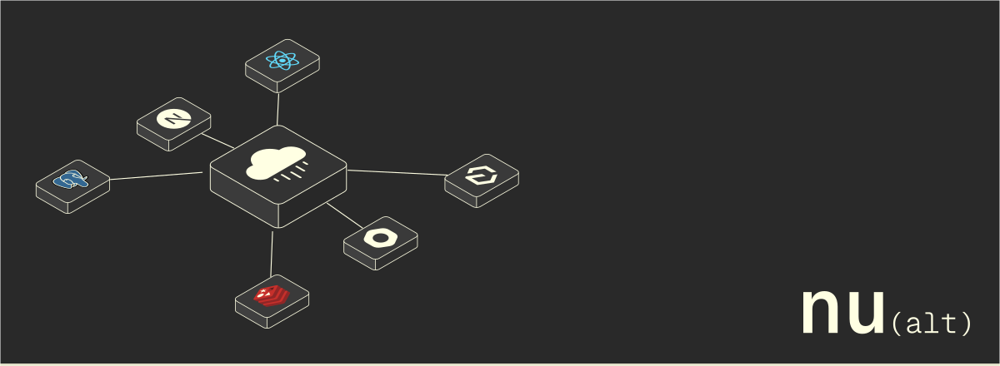

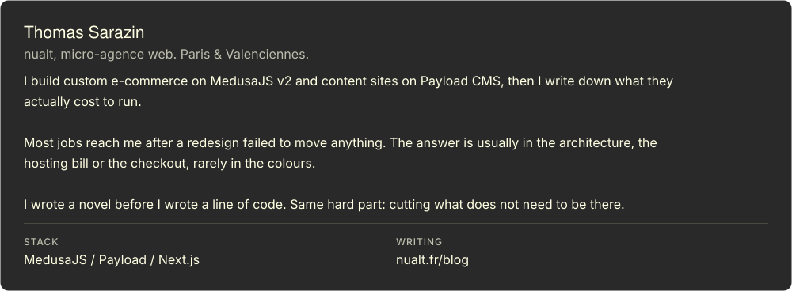

<table>
<tr>
<td width="50%"><a href="https://github.com/nualt/medusa-plugin-better-auth">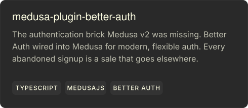</a></td>
<td width="50%"><a href="https://github.com/nualt/responsive-motion">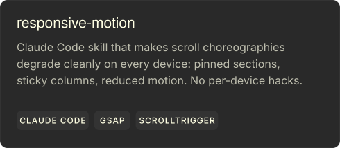</a></td>
</tr>
</table>

<table>
<tr>
<td width="50%"><a href="https://nualt.fr/blog/plugin-better-auth-medusa-v2">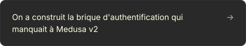</a></td>
<td width="50%"><a href="https://nualt.fr/blog/site-anime-responsive-methode-open-source">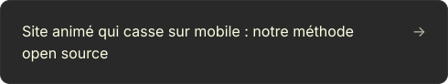</a></td>
</tr>
<tr>
<td width="50%"><a href="https://nualt.fr/blog/failles-nextjs-securite-hebergement">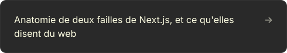</a></td>
<td width="50%"><a href="https://nualt.fr/blog/shopify-vs-medusa-ecommerce">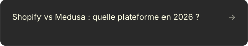</a></td>
</tr>
<tr>
<td width="50%"><a href="https://nualt.fr/blog/auto-heberge-vs-paas">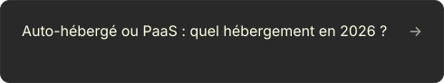</a></td>
<td width="50%"><a href="https://nualt.fr/blog/pourquoi-site-internet-coute-cher">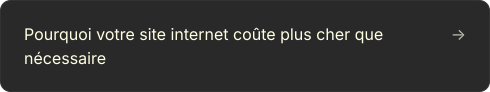</a></td>
</tr>
</table>

<a href="https://nualt.fr/blog">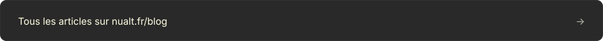</a>

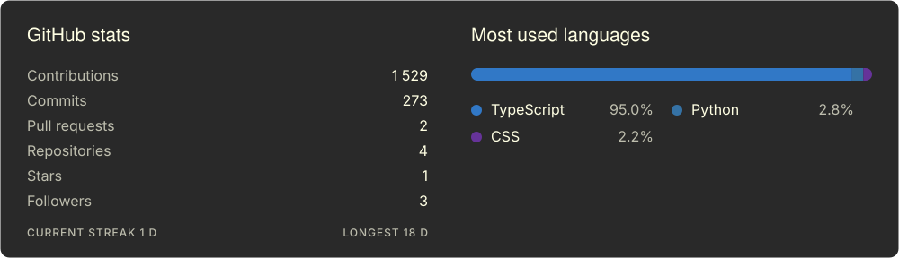

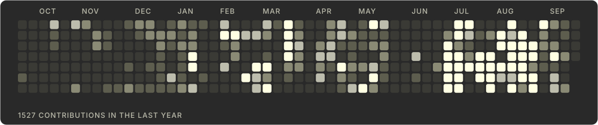

<table>
<tr>
<td width="25%"></td>
<td width="25%"></td>
<td width="25%"></td>
<td width="25%"><a href="mailto:thomas@nualt.fr">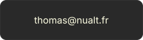</a></td>
</tr>
</table>

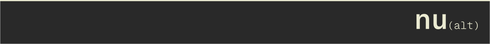
